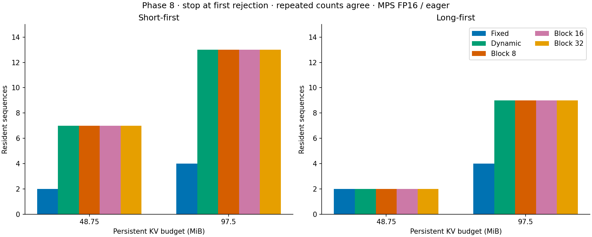

# KV-cache inference experiment

An experiment in how KV-cache storage strategies affect memory utilization,
resident-request capacity, and autoregressive decoding performance on Apple
Silicon. It runs Qwen2.5-0.5B-Instruct with fixed contiguous, exact-growth dynamic
contiguous, and block-based caches, comparing correctness and performance against
stock Transformers `DynamicCache`.

The starting question was whether allocating KV in blocks could avoid the waste
of reserving a maximum-length contiguous buffer for every request. An exact-growth
contiguous baseline was added to separate the benefit of allocating on demand
from the benefit of using blocks.

## Cache strategies

| Strategy | Storage | Work on growth or read |
| --- | --- | --- |
| Fixed contiguous | 2,080 positions per request | Append new KV; read through views |
| Dynamic contiguous | Exact current length | Allocate a replacement and copy the old prefix on each append |
| Block-based | Assign blocks from shared per-layer pools | Append into blocks; gather contiguous K/V for attention |
| Stock Transformers | Unmodified `DynamicCache` | External correctness and timing reference |

The block path is an integration adapter, **not a paged-attention kernel**.
Ordinary attention consumes gathered tensors. Dynamic relocation and block
gathering are recorded separately, including copied payload and temporary storage.
Stock is not wrapped in the custom fixed-budget admission logic.

## What the measurements showed

On an M3 Pro with 18 GiB unified memory, using Qwen2.5-0.5B-Instruct in FP16:

- Blocks reduced unused capacity assigned to a request, but unused pool blocks
  still counted toward the total reservation. Better assignment utilization did
  not mean lower total reserved memory.
- Under a 97.5 MiB persistent-KV budget with short requests admitted first, fixed
  contiguous retained 4 requests; dynamic contiguous and all three block sizes
  retained 13. Block-based caches matched dynamic contiguous capacity in every
  tested budget/order case.
- At 2,048 prompt tokens and eight resident requests, median aggregate decode
  throughput was 36.47 tokens/s for stock, 35.16 for fixed, 34.53 for dynamic,
  and 20.70 for block-32. Block-8 and block-16 were slower still.
- All 720 measured groups in the full performance sweep matched stock token IDs.
  Separate full-logit validation had a maximum absolute difference of zero.

These are bounded workloads, not general rankings. Requests remain resident
together, but model forwards run sequentially. The persistent-KV budget excludes
weights and temporary tensors; it is not a process-memory limit. Timing uses
eight generated tokens and six repeats per case, with observed ranges rather
than p95 estimates.



The [analysis](docs/phase10_analysis.md) brings together the plots, definitions,
and limitations. Allocating on demand helped relative to full reservation, but
blocks did not show an additional capacity benefit over the dynamic baseline,
and gathering added runtime overhead.

## Setup and first run

Tested with Python 3.13, PyTorch 2.8.0, and Transformers 4.57.6. From the repository
root, create a local environment and run the offline tests:

```sh
python3.13 -m venv .venv
source .venv/bin/activate
python -m pip install -r requirements.txt
python -m pytest -q
```

Alternatively, use `uv venv --python 3.13` and `uv pip install -r requirements.txt`.
The tests use synthetic tensors, tiny randomly initialized models, and saved
reports; they do not download weights or establish real-model MPS compatibility.

Run a short stock-cache generation on CPU, downloading the pinned model used by
the experiments:

```sh
python scripts/run_basic_generation.py --device cpu \
  --revision 7ae557604adf67be50417f59c2c2f167def9a775 \
  --max-new-tokens 16 --runs 1
```

Weights and tokenizer files go into `.cache/huggingface/` unless `HF_HOME` is
already set. No Hugging Face login is required. The environment and downloads
are ignored by Git. Add `--local-files-only` to reuse the cached snapshot offline.

The basic script uses stock generation with SDPA. Its streamer-based timings are
smoke measurements, not the later benchmark's timing method. Default precision
is FP16 on MPS and FP32 on CPU. An explicit `--device mps` fails if MPS is
unavailable; runtime failures are not silently retried on CPU.

### MPS compatibility

A later FP16/SDPA stock-reference workload produced nonfinite logits. The cause
is unresolved. The accepted full performance sweep and dynamic-capacity runs
use **eager attention consistently across all strategies**. Earlier successful
SDPA runs should not be read as blanket compatibility evidence.

After downloading the model, compare the custom caches against stock:

```sh
python scripts/verify_cache_integration.py --device mps --attention eager \
  --output results/verify_mps_new.json
```

Use `--device cpu` for a CPU-only check. MPS execution needs Metal access; tests
and saved-result analysis do not. See the [integration findings](docs/phase6_findings.md)
and [dynamic-baseline findings](docs/dynamic_baseline_findings.md).

## Reproduce the experiments

These runners use cached weights. Choose new output paths: existing result files
are not overwritten. Run timing experiments without competing benchmark processes.

### Resident capacity

```sh
python scripts/run_capacity_benchmark.py --device mps --attention eager \
  --output results/capacity_mps_new.json
python scripts/summarize_capacity_benchmark.py results/capacity_mps_new.json \
  --output results/capacity_mps_new_summary.json
```

This compares fixed, dynamic, and blocks 8/16/32 under two persistent-KV budgets
and two workload orders. Admission stops at the first request that will not fit.
Release, replacement, and continuation check that retained state stays correct.

### Latency and throughput

Start with a small CPU check:

```sh
python scripts/run_round_robin_check.py --device cpu --smoke \
  --output results/timing_cpu_new.json
```

For a full MPS context slice:

```sh
python scripts/run_round_robin_check.py --device mps --full-slice --context 128 \
  --output results/timing_new_128.json
```

Repeat sequentially for contexts 256, 512, 1024, and 2048 with corresponding
output filenames, then validate and summarize the complete matrix:

```sh
python scripts/summarize_performance_sweep.py \
  results/timing_new_128.json results/timing_new_256.json results/timing_new_512.json \
  results/timing_new_1024.json results/timing_new_2048.json \
  --output results/timing_new_summary.json
```

Each context covers 1/2/4/8 resident requests, all six variants, one warmup per
case, and six measured repetitions with rotating variant order. The full sweep
is substantially longer than a smoke check.

Core TTFT includes cache setup and waiting behind earlier prefills, but excludes
model loading, tokenization, and initial input transfer. Request TPOT includes
scheduler waiting. Aggregate decode throughput excludes prefills and counts
predictions after each request's first token. Detailed copy instrumentation runs
separately from primary timings. See the [full methodology](docs/phase9_full_findings.md).

### Rebuild plots without inference

Saved raw results are included. Install the optional analysis dependencies and
choose a new output directory:

```sh
python -m pip install -r requirements-analysis.txt
python scripts/analyze_results.py --output-dir results/analysis_new
```

For a uv-managed environment, use `uv pip install -r requirements-analysis.txt`.
The script validates the source matrices and creates six plots, four CSV tables,
and a manifest of input/source hashes. Memory accounting, capacity, and timing
remain separate experiments; historical pilot timings are not pooled into the
full sweep.

## Code and experiment notes

- `src/kv_engine/`: caches, block allocation, model adapters, admission accounting,
  and the round-robin decode loop.
- `tests/`: allocation boundaries, cleanup/reuse, correctness, accounting, and
  result validation.
- `scripts/`: model inspection, experiment runners, summaries, and plotting.
- `results/`: raw observations, derived tables, and figures.
- `docs/`: design notes and findings recorded as the experiments developed.

For detail: [KV layout](docs/phase2_findings.md),
[fixed contiguous](docs/phase3_findings.md), [block allocator](docs/phase4_findings.md),
[block cache](docs/phase5_findings.md), [memory accounting](docs/phase7_findings.md),
[dynamic baseline](docs/dynamic_baseline_findings.md), and
[combined analysis](docs/phase10_analysis.md).

Open questions include the SDPA failure, longer-decode relocation costs,
geometric contiguous growth, and attention that reads blocks directly. None is
answered by the current short-generation gather-copy experiment.
