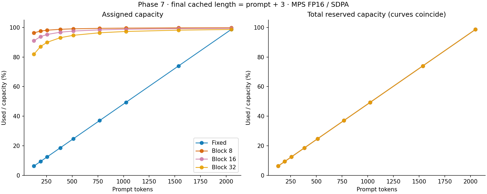
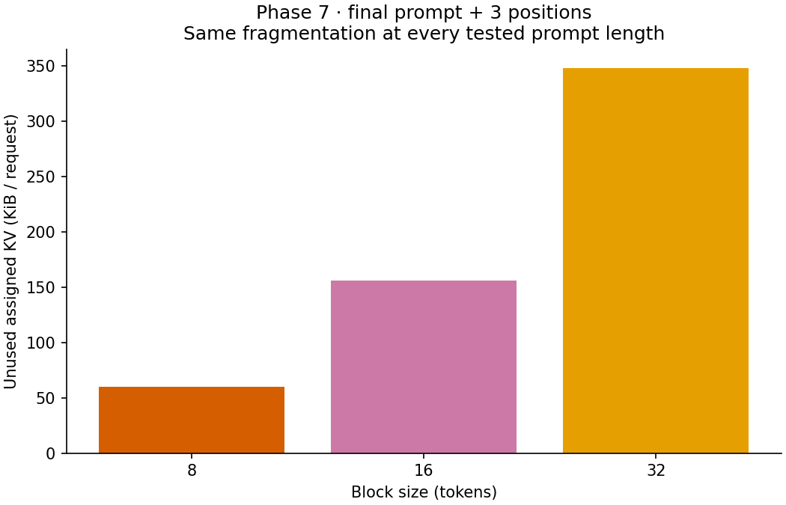
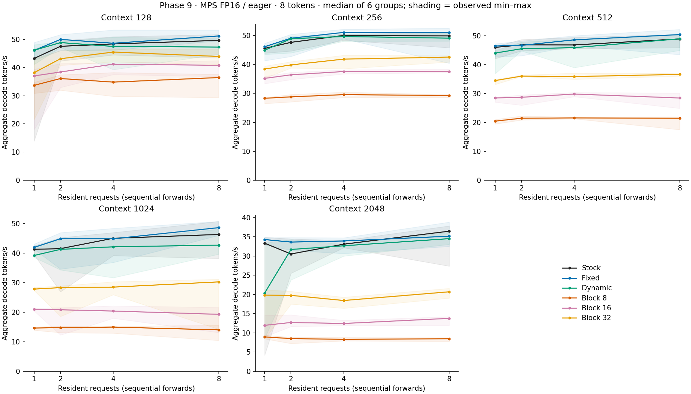
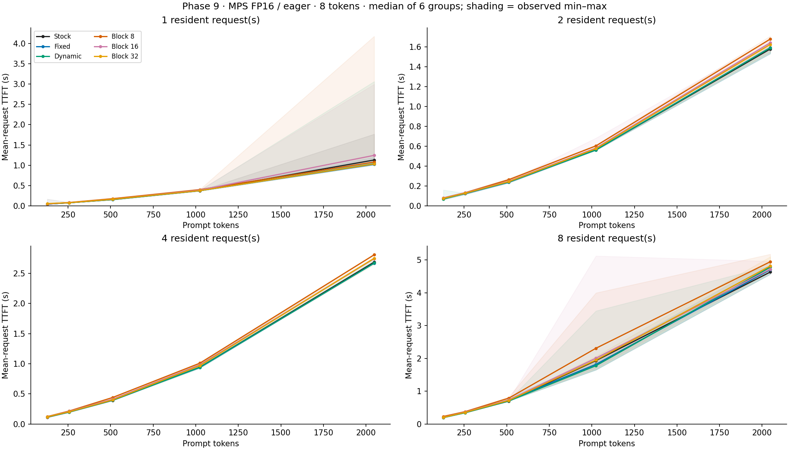
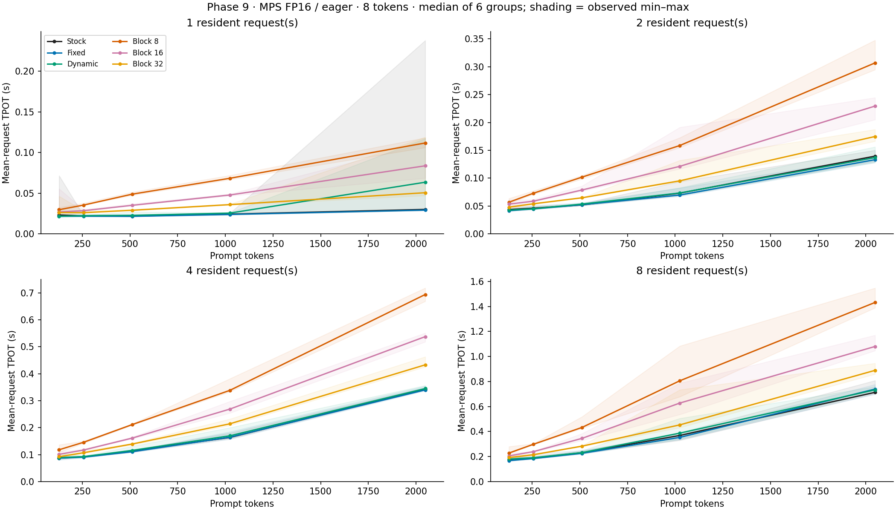

# What the cache experiments show

Block allocation solves the fixed baseline's over-reservation problem, but this
implementation has not shown a capacity advantage over exact-growth contiguous
storage. Its gather-copy integration also costs substantial decode time. The
result is a working allocation/correctness study, not an optimized serving engine.

## Evidence boundaries

All results use the pinned Qwen2.5-0.5B-Instruct on the same M3 Pro with MPS FP16.
These experiments answer different questions and are not pooled into one score:

| Evidence | Workload | What it establishes |
| --- | --- | --- |
| Phase 7, SDPA | Nine prompt lengths, four predictions, two repeats | Assigned vs reserved KV and block fragmentation |
| Phase 8 dynamic extension, eager | Two budgets, two orders, five variants; repeated matrix | Resident capacity under a persistent-KV budget |
| Phase 9 full sweep, eager | Five lengths, 1/2/4/8 residents, six variants, eight predictions, six repeats | Short-generation latency and aggregate decode throughput |

The historical FP16/SDPA nonfinite-logit failure remains unresolved. Accepted
Phase 7 accounting is not evidence that every SDPA workload is compatible.
The later experiments consistently use eager attention for every strategy.
Stock Transformers remains an external correctness/performance reference, not
a custom admission-controlled strategy.

## 1. Assignment efficiency is not total-memory saving



Phase 7 plots the first repetition's final snapshot (prompt + 3 cached tokens).
The CSV retains both repetitions. Blocks assign near the needed length, while
fixed contiguous assigns all 2,080 positions. Yet every path reserves 24.375 MiB
per request, including unused pool blocks. The total-reservation curves coincide.
Across all mixed-length observations, used/assigned utilization is 36.73% for
fixed versus 99.35%, 98.33%, and 96.34% for blocks 8/16/32. Used/reserved remains
36.73% for every strategy. These are ratios of summed bytes, not simultaneous
occupancy or total process-memory measurements.

Dynamic contiguous was added later; there are no invented dynamic Phase 7
observations in this plot. Its later measured accounting shows exact retained
storage, with temporary old-plus-new buffers during growth accounted separately.

## 2. Smaller blocks waste fewer final slots



Every Phase 7 prompt length is divisible by 32. Prefill fragmentation is therefore
zero for all block sizes; after three cached decode positions, unused assigned
slots are 5/13/29, or 60/156/348 KiB per request across all layers. The plot uses
the 128-token case; the same counts occur at every tested length. This controlled
alignment is not a representative distribution of production prompt lengths.

## 3. The stronger contiguous baseline changes the conclusion


| Budget | Order | Fixed | Dynamic | Blocks 8 / 16 / 32 |
| --- | --- | ---: | ---: | ---: |
| 48.75 MiB | Short-first | 2 | 7 | 7 / 7 / 7 |
| 48.75 MiB | Long-first | 2 | 2 | 2 / 2 / 2 |
| 97.5 MiB | Short-first | 4 | 13 | 13 / 13 / 13 |
| 97.5 MiB | Long-first | 4 | 9 | 9 / 9 / 9 |

Both MPS matrices agree on these counts and persistent accounting. Admission
stops at the first rejection; large requests are not skipped. KV remains resident
simultaneously, but forwards are sequential. Release, replacement, and later
continuation were checked against stock.

Blocks achieve 1.00–3.50 times the fixed baseline's capacity in these cases,
but **exactly 1.00 times dynamic contiguous's capacity**. This is evidence against
claiming an inherent capacity advantage over all contiguous caches. At the small
short-first budget, dynamic retains 40,452,096 bytes after continuation while the
block pool reserves 51,118,080 bytes, holding the same seven requests.

The budget excludes model weights, attention temporaries, dynamic growth buffers,
and gathered K/V. It is not an instantaneous unified-memory or process limit.

## 4. The gather-copy adapter is the performance limitation



The curves show medians across six measured groups; shading is observed min–max,
not confidence intervals. All samples remain included. Increasing resident count
does not multiply aggregate throughput because model forwards are sequential.

At context 2,048 / eight residents, median tokens/s is 36.47 stock, 35.16 fixed,
34.53 dynamic, and 8.48/13.78/20.70 for blocks 8/16/32. Relative to dynamic in
that case, even block-32 has about 40% lower throughput. This is a case-specific
observation, not an overall speed ratio or a claim about optimized paging.

Larger blocks help the gather adapter in these measurements, but trade away
assignment granularity. All three sizes gather the same payload at matched
lengths; their traversal/slicing/dispatch work differs. The data does not isolate
which overhead dominates or establish a universal best block size.

Exact-growth dynamic also copies old prefixes on every append. At context 2,048
/ eight residents, its diagnostic relocation payload is 1,411,350,528 bytes,
versus 1,613,365,248 gathered bytes for each block variant. Dynamic's allocation
plus relocation interval totals 0.354 s; block gather intervals total
8.214/4.838/2.551 s. These are separate instrumented runs, not pure copy costs
or components to subtract from primary latency. All custom variants additionally
write 202,014,720 bytes of new KV. See `copies.csv` for all cases and temporaries.

## 5. Resident requests pay scheduler waiting





All requests arrive together. Cache setup precedes prefills in request order;
decode then proceeds round-robin. TTFT includes waiting behind earlier prefills.
TPOT includes waiting for other requests, including remaining prefills during the
first interval. These are request latencies, not isolated model service times.

For stock at context 2,048, increasing residents from one to eight raises median
mean-request TTFT from 1.13 to 4.63 s and TPOT from 0.030 to 0.713 s, while
aggregate decode throughput changes from 33.35 to 36.47 tokens/s. Keeping more
requests resident is therefore distinct from increasing parallel compute.

## Conclusion and limits

Against a deliberately maximum-reserved baseline, block allocation can justify
its bookkeeping by fitting more resident requests. Against the implemented
exact-growth baseline, this evidence shows no additional admitted capacity and
a substantial runtime penalty for the gather adapter. There is **no demonstrated
net performance/capacity win over dynamic contiguous on these workloads**.

That does not invalidate block allocation: this code does not implement an
attention kernel that consumes blocks directly. It establishes allocation,
ownership, reuse, accounting, and real-model correctness, and exposes the cost
of materializing contiguous attention inputs. Geometric contiguous growth,
direct block-aware attention, long-decode churn, and representative arrivals
would be different follow-up experiments—not completed results.

Six repeats and eight generated tokens do not support p95 or production-serving
claims. Background load/thermal state were not isolated, and context/request
order was ascending. Historical pilot timings are not pooled with this sweep.
No total-memory saving, universal block-size optimum, or parallel scalability
claim follows from these plots.

## Reproduce without model inference

Install the optional `requirements-analysis.txt` in the project virtual
environment, then use a new output directory:

```sh
.venv/bin/python scripts/analyze_results.py --output-dir results/phase10_new
.venv/bin/python -m pytest -q
```

The script validates raw source matrices with their existing summarizers before
extracting tables, checks repeated capacity accounting, and refuses to overwrite
an output directory. It produces six PNG figures plus `memory.csv`, `capacity.csv`,
`timing.csv`, and `copies.csv`. The [manifest](../results/phase10/manifest.json)
records input hashes, analysis-script hash, plotting version, and row counts.
Rendering is CPU-only with a project-local Matplotlib cache. No new inference,
model downloads, or GPU access were used for this analysis.

All 189 tests pass, including analysis checks for matrix sizes, source provenance,
reservation versus assignment, and separate dynamic/block copy counts. All six
rendered figures were visually checked for readable labels and unclipped layout.

Phase 10's saved-evidence analysis is complete. Optional prefix caching is not
implemented or started by this checkpoint.
